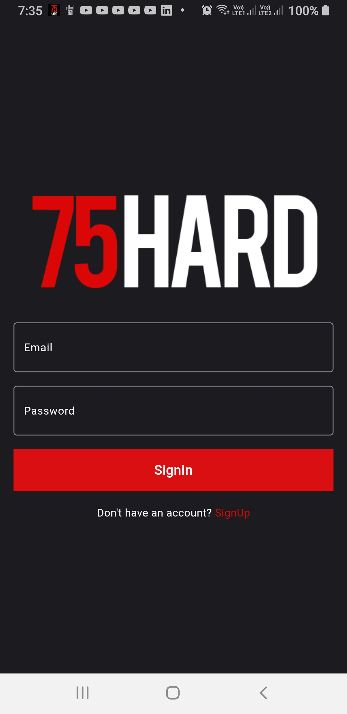
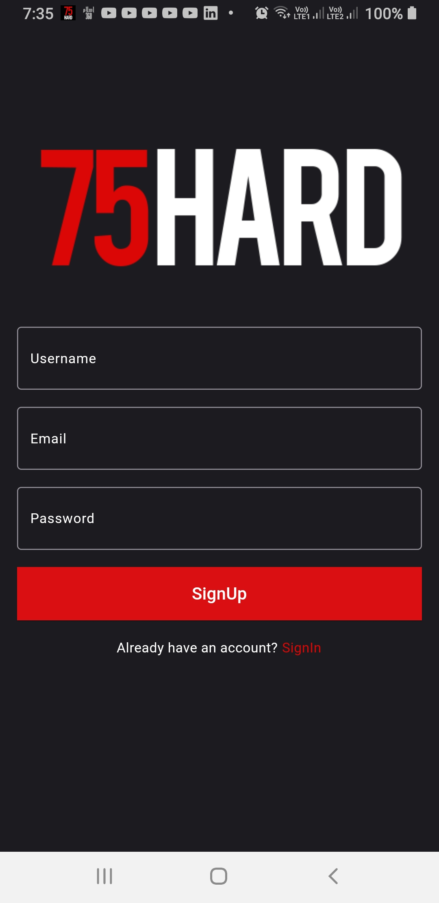
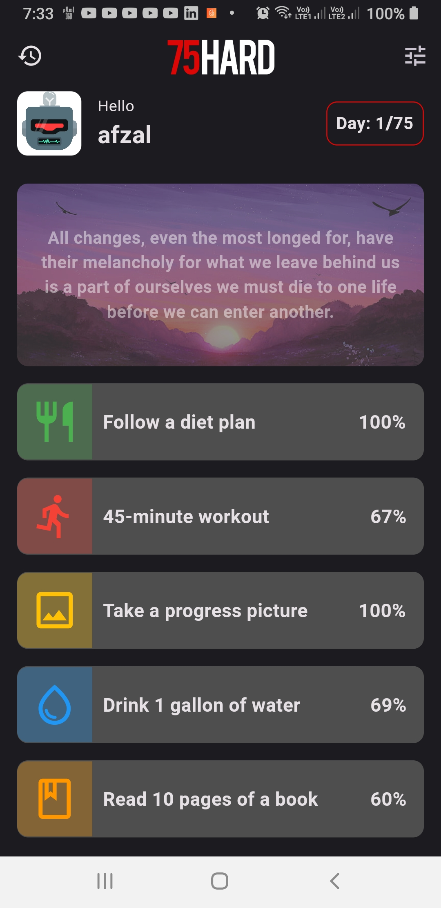
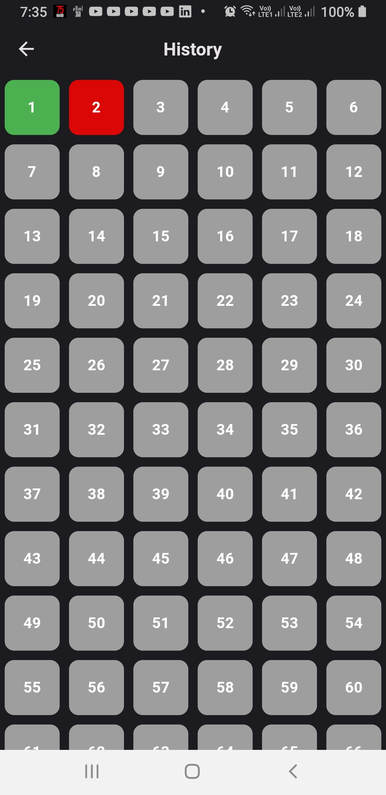
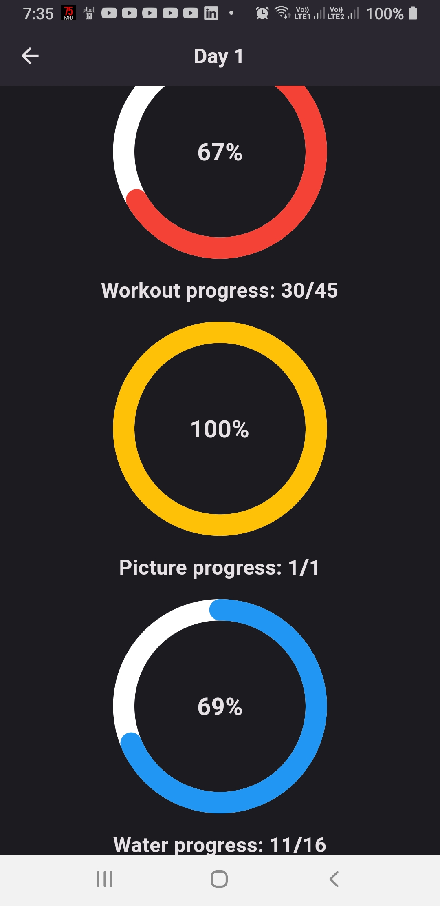
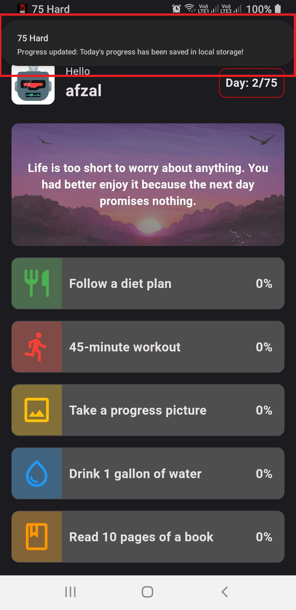
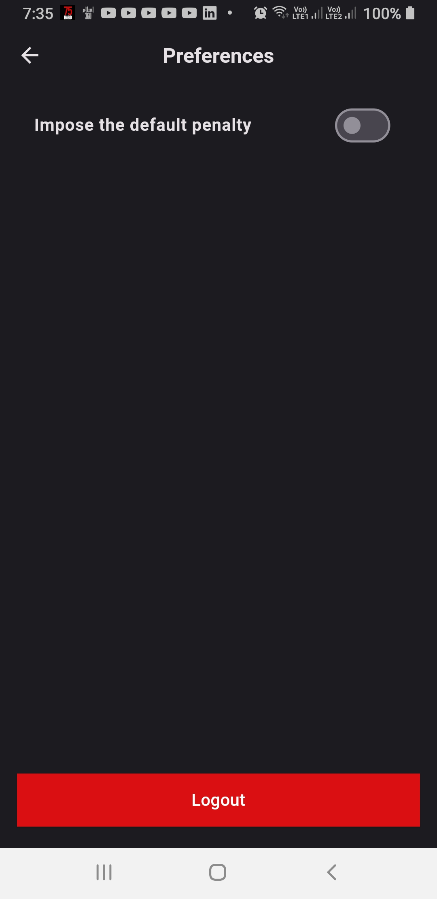

# Seventy Five Hard

This is a Flutter app that helps you track your progress on the 75 Hard challenge. It is based on the [75 Hard](https://andyfrisella.com/pages/75hard-info) challenge by Andy Frisella. It is a 75 days challenge, where you have to follow a strict diet and workout plan for 75 days. If you miss a single day, you have to start from day 1 again. This application is based on the same concept.

## Features

- User can register and login
- User can see the list of all the challenges
- User can see the details of a particular challenge
- User can keep track of their progress
- User can see the inspirational quotes on the home screen
- User can view their progress history
- User will get a notification to remind them to complete their daily tasks
- User's progress will be saved locally in the device
- User will recieve a notification, when the progress is saved locally(at 11:30PM)
- For reading task, user can see a list of books

## Screenshots

<table>
  <tr>
    <td>Sigin</td>
     <td>Signup</td>
     <td>Home</td>
  </tr>
  <tr>
    <td></td>
    <td></td>
    <td></td>
  </tr>  <tr>
    <td>History</td>
     <td>Day History</td>
     <td>Notification</td>
  </tr>
  <tr>
    <td></td>
    <td></td>
    <td></td>
  </tr><tr>
    <td>Preferences</td>
  </tr>
  <tr>
    <td></td>
  </tr>
 </table>
